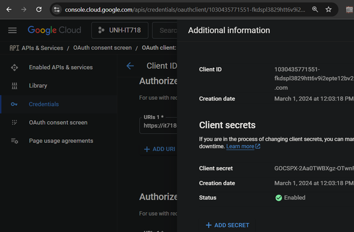

# Nadialin

Cloud based "king-of-hill" style cybersecurity practice environment.  
> [!NOTE]
> 'nadialin' is Abenaki for 'the hunter'

### What is a "King-of-hill" event?
- Everyone (teams or individuals) are given access to a system they own.
- At the start all systems are indentical and insecure.
- The team secures their system and as a by-product understands how to attack other systems.
- A specific file "flag" on the system indicates ownership of that system.
- You want to control the ownership of the flag on as many systems as possible.
- Points are scored by periodic polling of flags on all systems.
- Most points in given time frame wins.

> [!WARNING]
> As of April 2025 this repo is once again under active development.  The ultimate goal of this effort is to allow cybersecurity clubs to host staged events.
> __Expect broken items__ 

## Phases to running a Nadialin event

### Basic requirements
- [ ] AWS account for the event admin.  Event participants (hunters) do not need AWS knowledge or access.
- [ ] Register an app with Google Developer Console; you need an app OIDC client ID for event logins
- [ ] DNS domain (optional)
### Deploy infrastructure
- [ ] In AWS CLoudShell; clone this repo
- [ ] Deploy infrastructure;  `cd ./deploy && sh deploy.sh`
  - Nadialin uses CloudFormation templates to create the required infrastructure: S3, VPC, DynamoDB, IAM, Apigtewayv2, Lambda functions, and CloudFront.
  - At idle/unused the infrastructure is free.
  - The infrastructure can be deployed well in advance of the event.
### Event configuration
- [ ] Determine the configuration, services, and backdoors of the instances you will be using in the event.
- [ ] Define the event's EC2 launch template
- [ ] Enroll squads and hunters
### Run the event
- [ ] Deploy event instances
- [ ] Deploy OpenVPN server (not in beta)
- [ ] Start scoring
- [ ] Replace the waiting page with the home page
- **Have fun!**

## Steps to deploy the infrastructure
1. In an AWS Cloudshell clone this repo: `git clone `
2. Change to the deploy folder: `cd nadialin/deploy`
3. Set the environment to your values: `nano .env`
4. Run the deployment script: `sh deploy.sh`

> [!WARNING]
> The remainder of this page is a work in progress
## Lambdas
- Naming: {deploy-name}-{function-name}
- Tagging: Lambdas can be indentified by "Name" and "DEPLOY" tags
- Creation: During the CloudFormation backend stage.
- Invocation: All lambda support being called from the CommandShell(CS) and depending on function either EventBridge(EB) or ApigatewayV2(API).  See code comments for required arguments.
- Platform: Tested with Python3.13

### Scoring functionality
- __instanceState__: Invoked by (EB) rule __{deploy-name}-instanceState__ when a EC2 reaches running state.  An (EB) rule __{deploy-name}-doServiceCheck-{check-name}__ is created for each service on the new machine.   Rules are created disabled and set to fire every minute when enabled.
- __doServiceCheck__: Invoked by (EB) rule __{deploy-name}-doServiceCheck-{check-name}__. Checks one service on a single machine, returning True/False.
- __startScoring__: Invoked by (CS/API) enables all EventBridge __doServiceCheck__ rules and open SecurityGroup for access to instances.
- __endScoring__: Invoked by (CS/API) disables all EventBridge __doServiceCheck__ rules and close SecurityGroup access.
- __eventScores__: Invoked by (CS/API) retrieves current score for all squads.

### Event Management
All can be invoked by (CS) or (API)
- __backupEvent__: Dump all DynamoDB tables to format readable by __restore_event.
- __restoreEvent__: Delete current table items and replace with daa from previous __backupEvent__.
- __databaseItems__: CRUD functions for all DynamoDB tables.
- __runInstances__: Start all machnes for all squads.
- __verifyToken__: Callback during OIDC authentication flow
- __manageInstance__: Not implemented in beta

## API functions
functions (lambda=eventData) R(get) U(put) D(delete)
- event
- squad, hunter
- machine, instance, service, serviceCheck/{machine}(get only)
  
- squadUpdate  ( like many function allow edit of json data to add/delete)

### PRE-EVENT FUNCTIONS  
register running machine  
generating instances create new DB instance table items  

### IN EVENT API FUNCTIONS (lambda=?)
- runInstances
- terminateInstances
- restartInstance/{name}
- getInstanceState/{name}
- validate hunter OIDC token
- generateOvpn/ {name}
- backupEvent : returns JSON
- restoreEvent  data={json}
- getScores => eventScores

## Databases (DynamoDB tables)
See the API document for methofd to update the tables.  The following is the purpose and required values for each of the tables.  Overloading items is possible for customizations.  All the table names are prefixed with the deployment(event) name to allow multiple events per AWS account.

- __Event__: (TBD) not currently used in the BETA. Possible start/stop times, landing page customizations, admin functions, etc
- __Hunters__:  For all hunters(users) name, email, uuid, and squad.  Itmes are generated on the hunter's first login.
- __Squads__: Name and score.  Set by admin action. Squads determine machines names and users accounts. Scores are recorded by squad.
- __Machines__: Typically a single item, create by admin action.  Name, templateName, and Services[].  EC2 instances are tagged with {name)-{squad}.  The same EC2 templateName is for all instances.  Services is a list of templated JSON objects. "get_flag" is required addtional services can be added.  When a instance is created the service template is expanded and added to the services table.
- __Instances__: One item for each running EC2 instance.  Created/destroyed with the instance.  Item contains: name, DNS name, IP address, and instanceId.
- __Services__: One item per every machine-squad:service combination. Created/destroyed with the instance.  Item contains: name, protocol, fully expanded service URL, expected_return, and points.
- __ServiceChecks__: Log of services attempted, Every service, for every machine, once per minute.  Does not persist in backupEvent/RestoreEvent cycle.

## Steps for instance configuration
## Steps for squad/hunter enrollment
## Steps to run the event

## What is needed to run an event?

Substantial AWS infrastructure is needed to support the creation, monitoring, and release of AWS resources.

## This repo focuses on the automation resources using CloudFormation
List of major AWS components
- S3 : GitHub action is used push to a public bucket; accss via CloudFront
- API Gateway : Defined with OpenAPI.  Lambda based functions
- VPN : Control user access to scenarios
- Scenario : Templated deployment the machines the user will work with

Validate deployment
At this point you should confirm your bucket is populated and publicly flapping in the breeze.

### Components
| CF* | Function | Purpose | Notes |  
| :---: | :---: | :--- | :--- | 
| ❌ | Github | Source (App & IoC) | Clone locally for customization
| ❌ | Google | OIDC provider | Generate client secret; set scopes
| ❌ | CloudFormation | IoC | Need to set custom values in ".env"
| ✅ | S3 Bucket | Static web content, Lambda packages, and EC2 launch templates | Globally unique; user defined name 
| ✅ | Lambda | OIDC verification and API implementation | 
| ✅ | DynamoDB | Storage of event information | 
| ✅ | API GatewayV2 | OpenAPI defined control of access to Lambda functions 
| ✅ | Route53 | Provide friendly URL |  
| ✅ | CloudFront | CDN for static pages and controls access to ApiGatewayV2 API | 

CF*: IoC deployment based on CloudFormation

### Google
Follow the Google provided steps to create OAuth 2.0 Client IDs: [LINK](https://developers.google.com/identity/openid-connect/openid-connect)  

> [!IMPORTANT]
> You will need to come back and adjust these settings once the CloudFront URLs are known.

__URIs:__
- The authorized Javascript origin will limit where your client ID can be used.
- The redirect URL will limit where the callback can be redirected to.
- You can have multiple values: (dev, testing, and production)
- Ports matter:  http://localhost and http://localhost:8080 are not the same.

> [!IMPORTANT]
> Edit the lambda function deploy/lambda/verifyToken.py and website/login.html to use your client id.

You can click on the more info button (upper right) to see your client id and secret.

## Configuring launch templates
### General recomendations
- Create both regular and overprivleged users
- Mismanage authenticatiion
- Manage the boot process. Template commands run once at creation time, not on reboot
- You own the boot process; think cron, think pwn'd processes
### Creating backdoors
Resources:
- [Github: Linux backdoor concepts](https://github.com/gquere/linux_backdooring)
- [Github: backdoors with examples](https://fahmifj.github.io/articles/linux-backdoors-and-where-to-find-them/)
- 
- 
